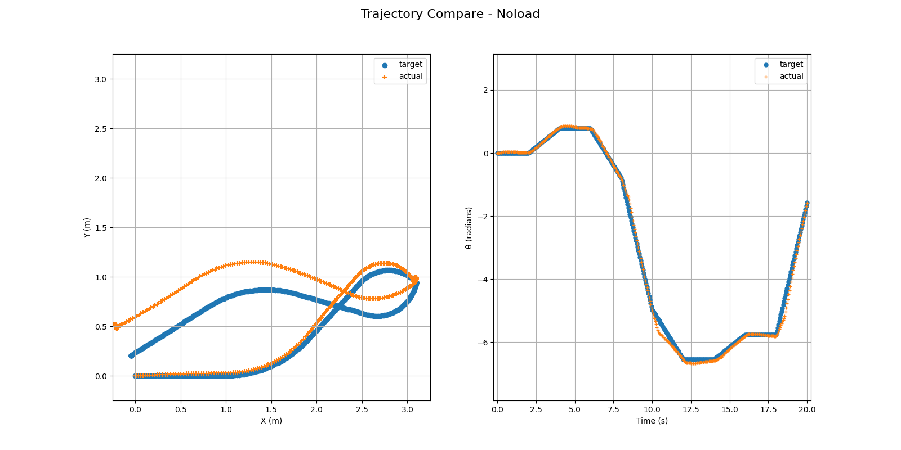
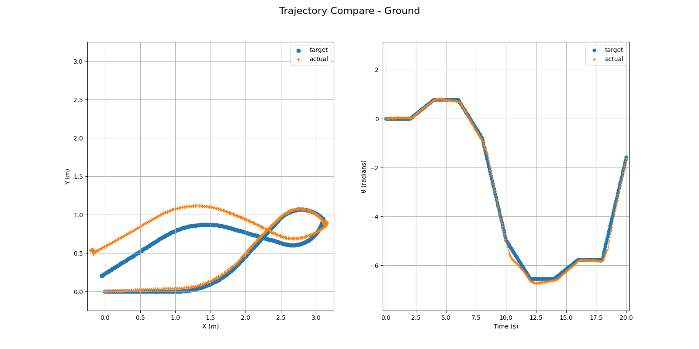

[](https://classroom.github.com/a/R9LNWs9-)
# Naive Odometry

## Objectives

- Build a bare minimal odometry system.
- Compare the robot's actual trajectory to its ideal trajectory.
- Get familiar with [HomeR](https://github.com/linzhangUCA/homer)'s control system.

## Requirements

### 1. (40%) Collect Velocity Data (Pico MicroPython)

Run [vel_data_collect.py](vel_data_collect.py) to drive your robot and collect data.
Uncomment the last 3 lines, store the target and actual velocity data on your Pico.

1. (20%) Lift the wheels and have a no-load test on the table. Collect data and upload the saved data to [data](/data/) directory.
2. (20%) Put the robot down on the ground to test again. Collect data and upload the saved data to [data](/data/) directory.

### 2. (60%) Calculate Trajectories

Complete [plot_traj.py](plot_traj.py).
Tackle the following requests.

1. (40%) Calculate the _ideal_ and _actual_ robot trajectories using the collected data.
Code the sections wrapped between the following comments.

```python
import sys
import os
import csv
import matplotlib.pyplot as plt
from math import pi, sin, cos

# Extract data
data_dir = os.path.join(sys.path[0], "data")
### START CODING HERE ### ~ 1 line
data_file = os.path.join(data_dir, "vel_data_1.csv")  # use your own data
### END CODING HERE ###
with open(data_file, newline="") as f:
    reader = csv.reader(f)
    vel_data = tuple(reader)
real_vels = []
for vd in vel_data:
    real_vels.append((float(vd[0]), float(vd[1])))
# Create target velocities
ref_vels = (
    (0.5, 0.0),
    (0.5, pi / 8),
    (0.4, 0.0),
    (0.35, -pi / 4),
    (0.0, -2 * pi / 3),
    (-0.35, -pi / 4),
    (-0.4, 0.0),
    (-0.5, pi / 8),
    (-0.5, 0.0),
    (0.0, 2 * pi / 3),
)
targ_vels = []
for i in range(len(real_vels)):
    targ_vels.append(ref_vels[int(i / 40)])
print(len(targ_vels))

# Calculate trajectory
x, y, th = [0], [0], [0]
x_hat, y_hat, th_hat = [0], [0], [0]
dt = 0.05  # seconds
for i in range(len(targ_vels)):
    lv = targ_vels[i][0]
    av = targ_vels[i][1]
    lv_hat = real_vels[i][0]
    av_hat = real_vels[i][1]
    ### START CODING HERE ### ~ 6 lines
    # Compute ideal trajectory
    dx = lv * (cos(th[i])) * dt
    dy = lv * (sin(th[i])) * dt
    dth = av * dt
    # Compute actual trajectory
    dx_hat = lv_hat * (cos(th_hat[i])) * dt
    dy_hat = lv_hat * (sin(th_hat[i])) * dt
    dth_hat = av_hat * dt
    ### END CODING HERE ###
    # Store ideal state
    x.append(x[-1] + dx)
    y.append(y[-1] + dy)
    th.append(th[-1] + dth)
    # Store actual state
    x_hat.append(x_hat[-1] + dx_hat)
    y_hat.append(y_hat[-1] + dy_hat)
    th_hat.append(th_hat[-1] + dth_hat)

# Plot data
fig, ax = plt.subplots(1, 2, figsize=(16, 8))
# Plot position trajectory
ax[0].scatter(x, y)
ax[0].scatter(x_hat, y_hat, marker="+")
ax[0].set_xlabel("X (m)")
ax[0].set_ylabel("Y (m)")
ax[0].set_xlim([-0.25, 3.25])
ax[0].set_ylim([-0.25, 3.25])
ax[0].grid()
ax[0].legend(["target", "actual"])
# Plot orientation traj
ts = list(range(len(x)))  # create timestamps for x axis
for i in range(len(x)):
    ts[i] = 0.05 * i
ax[1].plot(ts, th, ".", markersize="10")
ax[1].plot(ts, th_hat, "+", markersize="5")
ax[1].set_xlabel("Time (s)")
ax[1].set_ylabel("θ (radians)")
ax[1].set_xlim([-0.25, 20.25])
ax[1].set_ylim([-pi * 2.5, pi])
ax[1].grid()
ax[1].legend(["target", "actual"])
# Title
### CHOOSE APPROPRIATE TITLE ###
# fig.suptitle("Trajectory Compare - Noload", fontsize=16)
# plt.savefig("noload_traj.png")
fig.suptitle("Trajectory Compare - Ground", fontsize=16)
plt.savefig("ground_traj.png")
plt.show()
```

2. (20%) Plot the desktop and ground test trajectories and save them to the [images](images/) directory.
Then reveal the uploaded trajectory images below.

#### Noload Test Trajectory



#### Ground Test Trajectory



## Study Resrouces

### Frame Setup

#### Time Frame

- The robot will start moving at the moment of $t_0$, and end the motion at the instant of $t_T$.
- The robot's state will be examined every $\Delta t$ seconds, hence the $i$-th instant $t_i = t_{i-1} + \Delta t$ (where $`i \in \{ 1, 2, \dots, T \}`$).

#### Space Frame

- Body frame: $`\{x, y\}`$ is attached to the robot and will translate and rotate along the robot's movement.

The body frame's origin is sitting at the geometric center of the robot's base plate. The $x$ axis is always pointing to the head of the robot, and the $y$ axis is perpendicular to the $x$ axis and pointing to the left wheel.

- Global frame: $`\{X, Y\}`$ is fixed on the driving plane and will not move along the robot.

The Global frame will be generated according to the initial pose of the robot. The $`\{X, Y\}`$ frame will overlap with the initial $`\{x, y\}`$ frame.

### Robot's State of Motion

- The robot's motion will be restricted in the two dimensional $`\{X, Y\}`$ plane.
- The robot's pose at the $i$-th instant can be represented as $(X_i, Y_i, \theta_i)$ referring to the global frame.
$\theta_i$ is the angle from $X$ to $x$, with counterclockwise to be the positive direction.
- The robot's velocity at the $i$-th instant can be represented as $(v_i, \omega_i)$.
$v_i$ is the robot's linear velocity which is always on the $x$ axis.
$\omega_i$ is the robot's angular velocity which is an rotational quantity along the axis perpendicular to the $`\{x, y\}`$ plane.
$\omega_i$ is positive if the direction is counterclockwise.
- The trajectory of the robot can be represented as a sequence of the robot's states and can be illustrated as shown in the following figure.

```math
\{(X_0, Y_0, \theta_0, v_0, \omega_0), (X_1, Y_1, \theta_1, v_1, \omega_1), \dots, (X_T, Y_T, \theta_T, v_T, \omega_T)\}
```


At instant $t_i$, the change of the robot's pose can be calculated _approximately_ as:

```math
\Delta X_i = v_i \cos \theta_i \Delta t
```

```math
\Delta Y_i = v_i \sin \theta_i \Delta t
```

```math
\Delta \theta_i = \omega_i \Delta t

```

Therefore, the robot's new pose at $t_{i+1}$ can be calculated as:

```math
X_{i+1} = X_i + \Delta X_i
```

```math
Y_{i+1} = Y_i + \Delta Y_i
```

```math
\theta_{i+1} = \theta_i + \Delta \theta_i
```

## AI Policies

Please acknowledge AI's contributions according to the policies in the [syllabus](https://linzhanguca.github.io/_docs/robotics2-2025/syllabus.pdf).
